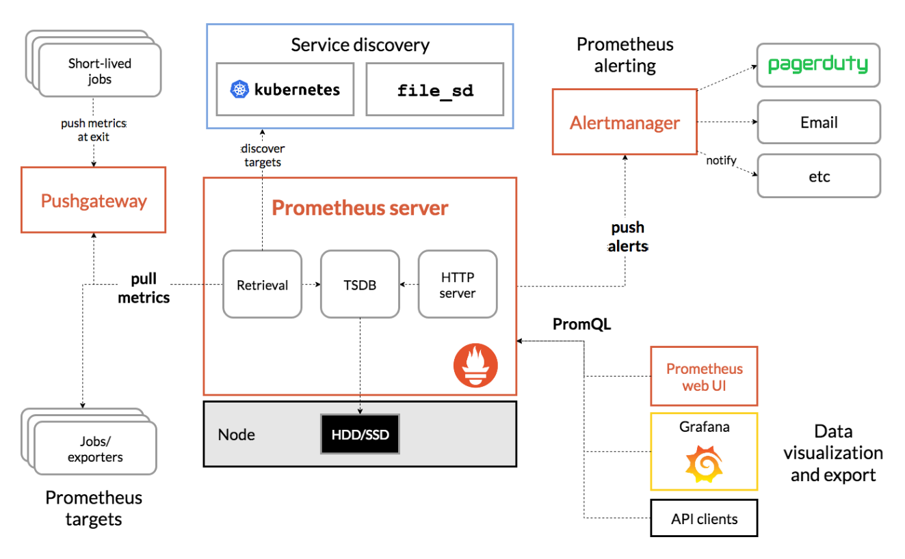

  <h1 align="center">Prometheus Monitoring And Alarm Tool</h1>
  

    <a href="README.md"><strong>English</strong></a> | <strong>简体中文</strong>
  

## Table of Contents

- [Repository Introduction](#repository-introduction)
- [Prerequisites](#prerequisites)
- [Image Specifications](#image-specifications)
- [Getting Help](#getting-help)
- [How to Contribute](#how-to-contribute)

## Repository Introduction
‌[Prometheus‌](https://github.com/prometheus/prometheus) Prometheus is an open-source monitoring and alarm tool. It was originally developed by SoundCloud and later became a graduation project of the Cloud Native Computing Foundation (CNCF) (at the same level as Kubernetes). It is designed for cloud-native environments and is suitable for monitoring requirements of dynamic microservice architectures.

**核心特性：**
1. Multi-dimensional Data Model：Prometheus employs a key-value-based time-series data model where each metric can be annotated with multiple labels (e.g., http_requests_total{method="POST", status="200"}), enabling granular monitoring. Its flexible PromQL query language supports multi-dimensional data aggregation, slicing, and calculations.
2. High-performance Time-series Database (TSDB)：Features a built-in, optimized TSDB with compression and block storage mechanisms, capable of handling millions of data points per second. Data is stored in time-partitioned chunks with a default 15-day retention period (configurable), ideal for high-frequency monitoring scenarios.
3. Dynamic Service Discovery：Natively integrates with Kubernetes, Consul, AWS, and other service discovery mechanisms to automatically detect topology changes. For example, in Kubernetes environments, it auto-discovers Pods and Services without manual target management.
4. Advanced Alerting System：Leverages Alertmanager for alert grouping, inhibition, and silencing. Alert rules are defined using PromQL, supporting complex conditions (e.g., duration thresholds, rate fluctuations) and multi-channel notifications (email, Slack, Webhook, etc.).
5. Visualization Integration：Includes a native expression browser and basic charts, with deep Grafana integration. Thousands of community-maintained dashboard templates enable rapid visualization setup.
6. Lightweight Deployment：Runs as a single binary with no external dependencies. Container-friendly and resource-efficient (2–4GB RAM for basic monitoring), suitable for edge computing and resource-constrained environments.
7. Rich Exporter Ecosystem：Offers hundreds of official/community exporters (e.g., Node Exporter, MySQL Exporter) for infrastructure, middleware, and applications. Supports custom metric exposure and multiple data formats.
8. Federation Capabilities：Supports hierarchical federation to aggregate data from multiple Prometheus instances into a central node, enabling large-scale distributed monitoring across regions or multi-tenant architectures.

This project offers pre-configured [**`Prometheus-监控和告警工具`**](https://marketplace.huaweicloud.com/intl/hidden/contents/48c73331-f084-4a64-b3f8-565f9bfd478e)，images with Prometheus and its runtime environment pre-installed, along with deployment templates. Follow the guide to enjoy an "out-of-the-box" experience.

**Architecture Design:**

> **System Requirements:**
> - CPU: 2vCPUs or higher
> - RAM: 4GB or more
> - Disk: At least 50GB

## Prerequisites
[Register a Huawei account and activate Huawei Cloud](https://support.huaweicloud.com/usermanual-account/account_id_001.html)

## Image Specifications

| Image Version | Description | Notes |
| --- | --- | --- |
| [Prometheus3.3.0-arm-v1.0]() | Deployed on Kunpeng servers with Huawei Cloud EulerOS 2.0 64bit |  |

## Getting Help
- Submit an [issue](https://github.com/HuaweiCloudDeveloper/Prometheus-image/issues)
- Contact Huawei Cloud Marketplace product support

## How to Contribute
- Fork this repository and submit a merge request.
- Update README.md synchronously based on your open-source mirror information.